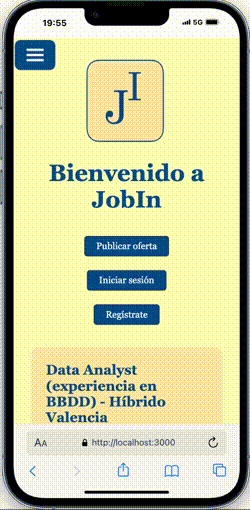
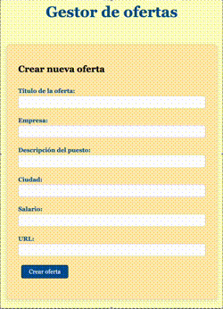

# Proyecto Front-Back portal empleo


# JobIn

JobIn es una aplicación web que simula una plataforma de búsqueda de empleo, desarrollada como proyecto colaborativo entre cuatro personas: **Alberto Diez**, **Ignacio Talvi**, **Mario López** y **Pablo Bacigalupe**.

<p align="center"></p>

## 🛠️ Tecnologías utilizadas

- **Frontend**:  
  - Motor de vistas: [Pug](https://pugjs.org/)
  - Diseño: Mobile First, responsive

- **Backend**:  
  - [Node.js](https://nodejs.org/)  
  - [Express.js](https://expressjs.com/)

- **Bases de datos**:
<p align="center">
<p align="center">

  - **PostgreSQL**:
  Utilizamos una base de datos relacional en la que guardamos dos tablas:
    - `persons`: Usuarios registrados (roles `user` y `admin`)  
    - `favoritos`: Ofertas de empleo guardadas por los usuarios

  - **MongoDB Atlas**:  
    - `Offers`: Almacenamiento de ofertas de empleo capturadas por scraping y que luego renderizaremos en la web

- **Control de versiones**: [GitHub](https://github.com/)

## 🚀 Funcionalidades principales

- **Visualización de ofertas**:  
  Al acceder a la home se listan todas las ofertas capturadas por scraping (actualmente desde [Ticjob](https://www.ticjob.es/)). Se muestran en una vista optimizada para móviles, organizadas en columna.

<p align="center"></p>

- **Publicar oferta**:  
  Botón visible en la cabecera que lleva a un formulario para ingresar una nueva oferta manualmente.

<p align="center"></p>

- **Enlaces externos**:  
  Cada oferta incluye un botón que redirige a la página original de donde se obtuvo la oferta.

- **Autenticación (en desarrollo)**:  
  Los botones *Iniciar sesión* y *Registrarse* ya están diseñados, pero aún no están funcionales en esta versión inicial.

## 🖼️ Diseño

El enfoque de diseño es **mobile first**, asegurando una experiencia óptima en pantallas pequeñas. Cada oferta muestra:

- Título del puesto
- Empresa que publica la oferta
- Ciudad
- Salario
- Enlace externo a la oferta original

## Despliegue en Render

👉🏻 https://job-api-f78b.onrender.com/

<p align="center"></p>

## 🩻 Estructura del proyecto

```bash
📁 JOB_API
├── 📁 config
│   ├── db_mongo
│   └── db_pgsql   
├── 📁 controllers
│   ├── admin.controller
│   ├── favorite.controller
│   ├── offer.controller
│   └── users.controller   
├── 📁 middlewares
│   ├── admin
│   ├── authMiddleware
│   ├── manage404
│   ├── morgan
│   └── roleMiddleware
├── 📁 models
│   ├── admin.model
│   ├── favorite.model
│   ├── offer.model
│   └── users.model 
├── 📁 node_modules
├── 📁 public
│   ├── css
│   ├── img
│   └── js
├── 📁 queries
│   ├── api.queries
│   └── createTables
├── 📁 routes
│   ├── admin.routes
│   ├── favorite.routes
│   ├── offer.routes
│   └── users.routes 
├── 📁 services
├── 📁 utils
│   ├── saveOffers
│   └── scraper
├── 📁 views
├── ⚙️.env
├── ⛔ .gitignore
├── index.js
├── {} JOB_API.code-workspace
├── 🔑 LICENSE
├── {} package-lock.json
├── {} package.json
├── 🗄️ queries.sql
├── ®️ README.md
├── {} swagger.json
```

## 📦 Instalación y ejecución

### Requisitos previos

- Node.js y npm instalados
- PostgreSQL corriendo localmente o remotamente
- Cuenta y clúster configurado en MongoDB Atlas

### Clonar el repositorio

```bash
git clone https://github.com/tu-usuario/jobin.git
cd jobin
```
